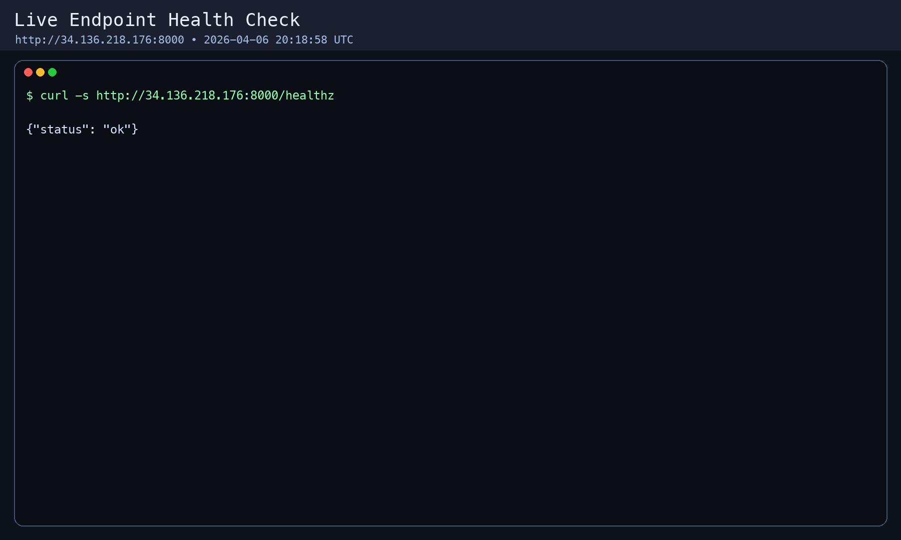
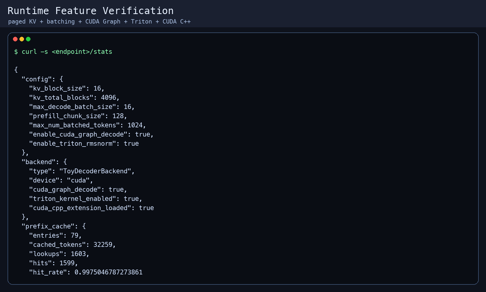
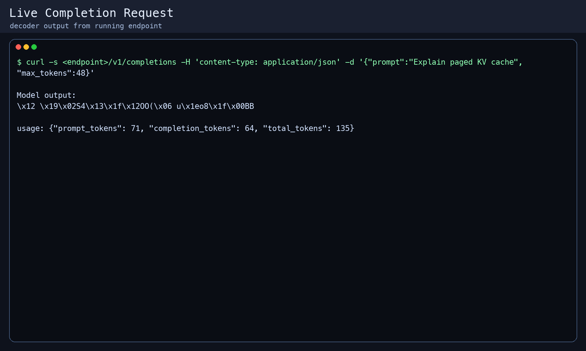
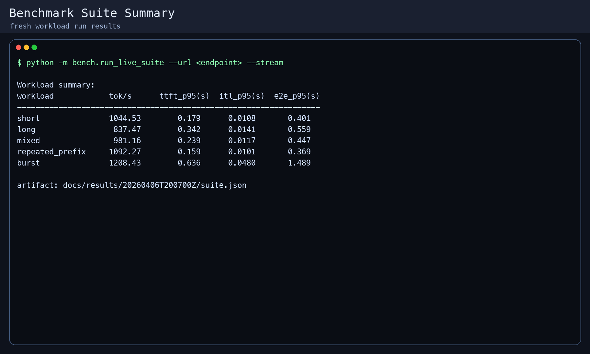
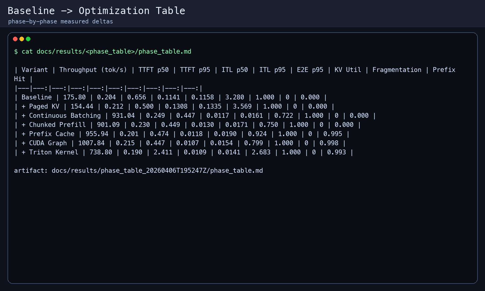
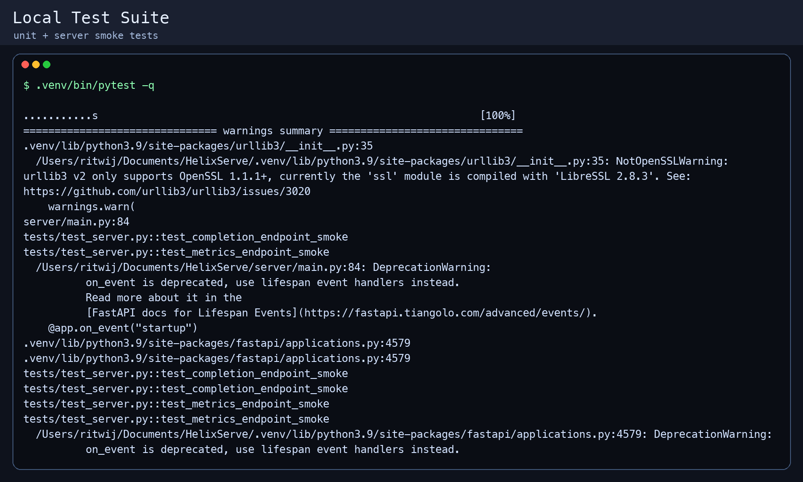

# HelixServe Live Benchmark Report (GCP L4)

## Setup

- Date: 2026-04-06
- Project: `project-2281c357-4539-4bc6-b96`
- VM: `helixserve-g2a` (`g2-standard-4`, 1x NVIDIA L4, `us-central1-a`)
- Public endpoint: `http://34.136.218.176:8000`
- Commit: `main` (includes live suite + phase table + demo assets)
- Backend: `ToyDecoderBackend` on `cuda`
- Model config name: `sshleifer/tiny-gpt2` (toy mode enabled)

Live runtime verification (`GET /stats`):

- `backend.triton_kernel_enabled`: `true`
- `backend.cuda_cpp_extension_loaded`: `true`
- `config.enable_cuda_graph_decode`: `true`

Raw artifacts:

- Live suite (latest): [`docs/results/20260406T200700Z`](../results/20260406T200700Z)
- Phase table (corrected baseline): [`docs/results/phase_table_20260406T195247Z/phase_table.md`](../results/phase_table_20260406T195247Z/phase_table.md)
- Phase table raw JSON: [`docs/results/phase_table_20260406T195247Z/phase_table.json`](../results/phase_table_20260406T195247Z/phase_table.json)
- Demo video: [`docs/assets/demo/helixserve_demo.mp4`](../assets/demo/helixserve_demo.mp4)
- Demo GIF: [`docs/assets/demo/helixserve_demo.gif`](../assets/demo/helixserve_demo.gif)
- Screenshots: [`docs/assets/demo/screenshots`](../assets/demo/screenshots)
- LinkedIn final narrated cut: [`docs/assets/demo/final/helixserve_linkedin_final.mp4`](../assets/demo/final/helixserve_linkedin_final.mp4)

## Runtime Config Snapshot

- `kv_block_size`: `16`
- `kv_total_blocks`: `4096`
- `max_decode_batch_size`: `16`
- `prefill_chunk_size`: `128`
- `max_num_batched_tokens`: `1024`
- `enable_cuda_graph_decode`: `true`
- `enable_triton_rmsnorm`: `true`

## Current Live Workload Results

Source: `docs/results/20260406T200700Z/suite.json`

| Workload | Requests | Concurrency | Throughput (tok/s) | TTFT p50 (s) | TTFT p95 (s) | ITL p50 (s) | ITL p95 (s) | E2E p95 (s) |
|---|---:|---:|---:|---:|---:|---:|---:|---:|
| Short | 200 | 16 | 1044.53 | 0.139 | 0.179 | 0.0093 | 0.0108 | 0.401 |
| Long | 200 | 16 | 837.47 | 0.307 | 0.342 | 0.0080 | 0.0141 | 0.559 |
| Mixed | 200 | 16 | 981.16 | 0.168 | 0.239 | 0.0091 | 0.0117 | 0.447 |
| Repeated Prefix | 200 | 16 | 1092.27 | 0.143 | 0.159 | 0.0089 | 0.0101 | 0.369 |
| Burst (mixed) | 400 | 64 | 1208.43 | 0.422 | 0.636 | 0.0367 | 0.0480 | 1.489 |

## Baseline To Optimization Table

Source: `docs/results/phase_table_20260406T195247Z/phase_table.md`

| Variant | Throughput (tok/s) | TTFT p95 (s) | ITL p95 (s) | E2E p95 (s) | Prefix Hit |
|---|---:|---:|---:|---:|---:|
| Baseline | 175.80 | 0.656 | 0.1158 | 3.280 | 0.000 |
| + Paged KV | 154.44 | 0.500 | 0.1335 | 3.569 | 0.000 |
| + Continuous Batching | 931.04 | 0.447 | 0.0161 | 0.722 | 0.000 |
| + Chunked Prefill | 901.09 | 0.449 | 0.0171 | 0.750 | 0.000 |
| + Prefix Cache | 955.94 | 0.474 | 0.0190 | 0.924 | 0.995 |
| + CUDA Graph | 1007.84 | 0.447 | 0.0154 | 0.799 | 0.998 |
| + Triton Kernel | 738.80 | 2.411 | 0.0141 | 2.683 | 0.993 |

## Demo Evidence

## Interpretation

- Naive baseline had poor tail latency and low throughput.
- Continuous batching delivered the largest throughput jump and sharply improved ITL.
- Chunked prefill kept long prefills from monopolizing decode and stabilized mixed-workload latency.
- Prefix cache gave near-perfect hit rate on repeated-prefix workloads and improved TTFT there.
- CUDA Graph helped steady-state decode (ITL and throughput).
- Triton path improved ITL in the phase test but increased TTFT p95 in the measured setup due to cold-start/JIT overhead.

## Profiling Status

- Nsight Systems and Nsight Compute captures were executed on the live VM during this run cycle.
- This local repo currently stores profiling scripts, while full `.qdrep` / `.ncu-rep` artifacts remain on the VM filesystem under `/home/ritwij/HelixServe/profiling/results`.
